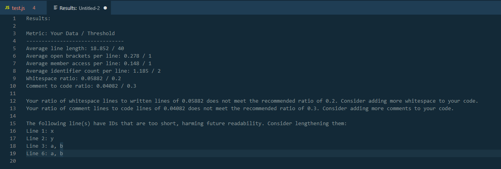

# Prettier-er Formatter for Visual Studio Code

[Prettier-er](https://github.com/OpenMindedPrettier) is an open-minded code formatter based on Prettier. It provides additional configuration options, allowing you to tailor the formatting rules to better suit your project's needs.


<p align="center">
  <em>
    JavaScript
    · TypeScript
    · Flow
    · JSX
    · JSON
  </em>
  <br />
  <em>
    CSS
    · SCSS
    · Less
  </em>
  <br />
  <em>
    HTML
    · Vue
    · Angular
  </em>
  <em>
    HANDLEBARS
    · Ember
    · Glimmer
  </em>
  <br />
  <em>
    GraphQL
    · Markdown
    · YAML
  </em>
</p>

<p align="center">
  <a href="https://marketplace.visualstudio.com/items?itemName=omp.prettier-er">
    </a>
  <a href="https://marketplace.visualstudio.com/items?itemName=omp.prettier-er">
    </a>
</p>

## Installation

Install through VS Code extensions. Search for `Prettier-er`

[Visual Studio Code Market Place: Prettier-er - Code formatter](https://marketplace.visualstudio.com/items?itemName=omp.prettier-er)

Can also be installed in VS Code: Launch VS Code Quick Open (Ctrl+P), paste the following command, and press enter.

```
ext install omp.prettier-er
```

## Prettier-ER

Prettier-er is built off of Prettier, and as such, shares most of its archecture with Prettier. The following documentation is largely centered around Prettier-er, focusing on the changes in this version of the formatter.

For full documentation of the original formatter, visit [Prettier Docs](https://prettier.io/docs/en/).

### Default Formatter

To ensure that this extension is used over other extensions you may have installed, be sure to set it as the default formatter in your VS Code settings. This setting can be set for all languages or by a specific language.

```json
{
  "editor.defaultFormatter": "omp.prettier-er",
  "[javascript]": {
    "editor.defaultFormatter": "omp.prettier-er"
  }
}
```

If you want to disable Prettier-er on a particular language you can either create a `.prettierignore` file or you can use VS Code's `editor.defaultFormatter` settings.

The following will use Prettier-er for all languages except Javascript.

```json
{
  "editor.defaultFormatter": "omp.prettier-er",
  "[javascript]": {
    "editor.defaultFormatter": "<another formatter>"
  }
}
```

The following will use Prettier-er for only Javascript.

```json
{
  "editor.defaultFormatter": "<another formatter>",
  "[javascript]": {
    "editor.defaultFormatter": "omp.prettier-er"
  }
}
```

Additionally, you can disable format on save for specific languages if you don't want them to be automatically formatted.

```json
{
  "[javascript]": {
    "editor.formatOnSave": false
  }
}
```

### Visual Studio Code Settings

You can use [VS Code settings](#prettier-er-settings) to configure prettier. Settings will be read from (listed by priority):

1. [Prettier configuration file](https://prettier.io/docs/en/configuration.html)
1. `.editorconfig`
1. Visual Studio Code Settings (Ignored if any other configuration is present)

> NOTE: If any local configuration file is present (i.e. `.prettierrc`) the VS Code settings will **NOT** be used.

## Usage

### Using Command Palette (CMD/CTRL + Shift + P)

```
1. CMD + Shift + P -> Format Document
OR
1. Select the text you want to Prettify-er
2. CMD + Shift + P -> Format Selection
```

### Formatting using Menu Bar

```
1. Click on the menu bar at the top of VS Code
2. Type '>' followed by a space.
3. Choose Format Document from the list. Type the command partially if you cannot find it.
```
> The above can also be followed to use the "Analyze Document (Metrics)" functionality.

# Changes from Prettier-er

The changes Prettier-er makes to Prettier primarially come in two categories:

1. Formatting Additions: These changes alter how the formatter behaves based on user settings.
2. Readability Analysis: Prettier-er introduces a tool that gathers metrics that indicate readable code, and suggest changes to improve readability.

## Formatting Additions

Prettier-er primarily adds optional code style formatting choices that change how the formatter works. Each of these can be enabled in VS Code's workspace settings, and are enumerated in [Prettier-er Settings](#Prettier-er-Settings).

The formatting additions in Prettier-er are implemented in each language individually. Currently, support has been extended to:

  - **JavaScript**
    - TypeScript
    - Flow
    - JSX
    - JSON
  - **CSS**
    - SCSS
    - Less

Each formatting option below will specify the languages supported by their primary language.

> NOTE: Similar languages (like typescript and javascript) use the same formatter, meaning they will both have access to Prettier-er's additions. Only the primary languages seen in the list above will be shown. But any sub-language ought to work with it as well.

### Allman Style

Supported languages: **Javascript**, **CSS**

Allman style places a newline character before each '{' character. For example:

Disabled:

    function helloWorld(){
      console.log("Hello, World!");
    }

Enabled:

    function helloWorld()
    {
      console.log("Hello, World!");
    }

### Force Object Break

Supported languages: **Javascript**

This setting forces object literals to exist on one or multiple lines, depending on the setting. The default setting preserves the existing Prettier functionality. 

Assume the following code for the next two settings:

    const user = {
      name: "John Doe",
      age: 30,
    };


[Preserve Functionality](https://prettier.io/docs/en/rationale.html#multi-line-objects) determines the status of individual objects, meaning that each object literal must be set to single or multi line. The following two apply to all object literals

forceSingleLine:

    const user = { name: "John Doe", age: 30 };

forceMultiLine:

    const user = {
      name: "John Doe",
      age: 30,
    };

**NOTE:** A current bug does not apply allman style to object literal breaks. This will be addressed in the future.

### Matrix Array

Supported languages: **Javascript**

Matrix array allows for arrays to be initialized on multiple lines, as in a matrix. With the setting enabled:

Formatting any array produces:

    return [1, 2, 3, 4];

To make the array into a matrix, place a newline after the final entry in any row, before the ','.

    return [1, 2
      , 3, 4];

When formatting is run, the array will be ordered like a matrix:

    return [
      1, 2,
      3, 4,
    ];

### Get Set One Line

Supported languages: **Javascript**

**Unstable: Get Set One Line currently does not function reliably. Further bug fixes will be needed to restore it.**

Get Set One Line automatically compresses getter and setter functions to a single line if:

1. The resulting line is below Prettier's printWidth character max.
2. The function only contains one body line of code.

For example,

    get name {
        return name;
    }

Will be formatted to,

    get name { return name; }

### Else Statement New Line

Supported languages: **Javascript**, **CSS**

Else Statement New Line places the `else` after the right bracket of the preceeding if statement, on a new line.

Disabled:

    if (true) {
      console.log("Foo");
    } else {
      console.log("Bar");
    }

Enabled:

    if (true) {
      console.log("Foo");
    }
    else {
      console.log("Bar");
    }

`else if` also works, behaving the same.

### Multi Empty Line

Supported languages: **Javascript**

Multi Empty Line allows for multiple lines of whitespace at the start and end of blocks.
This setting allows for code such as:

    get bar() {


      return [1];


    }

To remain spaced, instead of collapsing to:

    get bar() {
      return [1];
    }

when the setting is disabled.

### Retain Blank Lines

Supported languages: **Javascript**

Similar to Multi Empty Line, Retain blank lines allows for whitespace anywhere in a document, instead of being collapsed into a single line. This allows for code such as:

    get bar() {
      let funArray = [1, 2, 3];


      return funArray;
    }

To remain spaced, instead of collapsing to:

    get bar() {
      let funArray = [1, 2, 3];

      return funArray;
    }

when the setting is disabled.

### Selectors Same Line

Supported languages: **CSS**

A setting that allows multiple selectors to be on the same line.

Disabled:

    h1,
    h2 {
      margin: 3;
    }

Enabled:

    h1, h2 {
      margin: 3;
    }

## Readability Analysis

Prettier-er includes a new tool developed to congregate metrics that indicate readability of code. Our Readability Analysis tool is entirely optional, and is intended to be used by new programmers who want guidance on how to make their code more readable, but can be useful to anyone.

### How to use

Readability analysis can be performed on any document in VS Code by running a command in the same way one formats a document using Prettier-er.

In the searchbar at the top of your workspace, type '>' to reveal commands. From here, search for `Analyze Document (Metrics)`. Clicking on the result will cause the analysis to run.

The tool uses 6 metrics to assess the readability of a document. These are:

1. Average line length
2. Average open brackets ('[', '{')
3. Average member accessors
4. Average identifier count
5. Whitespace ratio
6. Comment-to-code ratio

Each of these metrics are found from your open document and compared against thresholds set in your workspace settings. These thresholds can be changed at any time.

If any metric breaks a threshold (Your average line length is too high, or your ratio of comment to code is too low), a separate message will be shown, suggesting improvements.

Below is a sample of the readability analysis


This is the result of using `Analyze Document (Metrics)` on the `test.js` file shown in the tabs.
All metrics are shown, alongside their threshold. Any that break the threshold (too high for the first 4, and too low for the last 2) get a message written at the bottom.

In addition to metrics, any identifiers that below a certain length are pointed out, with their related line number. This recommendation exists to encourage more informative variable names, and the threshold for length can be changed, just like the other metrics.

## Settings

### Prettier-er Settings

All Prettier and Prettier-er options can be configured directly in this extension.

> Below are Prettier-er unique settings. All can be changed through your VS Code workspace settings.

prettier.forceObjectBreak
prettier.matrixArray
prettier.allmanStyle
prettier.getSetOneLine
prettier.elseStatementNewLine
prettier.multiEmptyLine
prettier.retainBlankLines
prettier.selectorsSameLine
prettier.lineLengthRead
prettier.nestingCountRead
prettier.memAccessRead
prettier.commentToCodeRatioRead
prettier.whitespaceRatioRead
prettier.IDCountRead
prettier.IDMinLengthRead

> These are the base Prettier Settings. Information on them will not be provided here, please reference the Prettier documentation for more information.
> The default values of these configurations are always to their Prettier 2.0 defaults. In order to use defaults from earlier versions of prettier you must set them manually using your VS Code settings or local project configurations.

```
prettier.arrowParens
prettier.bracketSpacing
prettier.endOfLine
prettier.htmlWhitespaceSensitivity
prettier.insertPragma
prettier.singleAttributePerLine
prettier.bracketSameLine
prettier.jsxBracketSameLine
prettier.jsxSingleQuote
prettier.printWidth
prettier.proseWrap
prettier.quoteProps
prettier.requirePragma
prettier.semi
prettier.singleQuote
prettier.tabWidth
prettier.trailingComma
prettier.useTabs
prettier.vueIndentScriptAndStyle
prettier.embeddedLanguageFormatting
```


## Error Messages

**Failed to load module. If you have prettier or plugins referenced in package.json, ensure you have run `npm install`**

When a `package.json` is present in your project and it contains prettier, plugins, or linter libraries this extension will attempt to load these modules from your `node_module` folder. If you see this error, it most likely means you need to run `npm install` or `yarn install` to install the packages in your `package.json`.

**Your project is configured to use an outdated version of prettier that cannot be used by this extension. Upgrade to the latest version of prettier.**

You must upgrade to a newer version of prettier.

**This workspace is not trusted. Using the bundled version of prettier.**

You must trust this workspace to use plugins and local/global modules. See: [Workspace Trust](https://code.visualstudio.com/docs/editor/workspace-trust)
